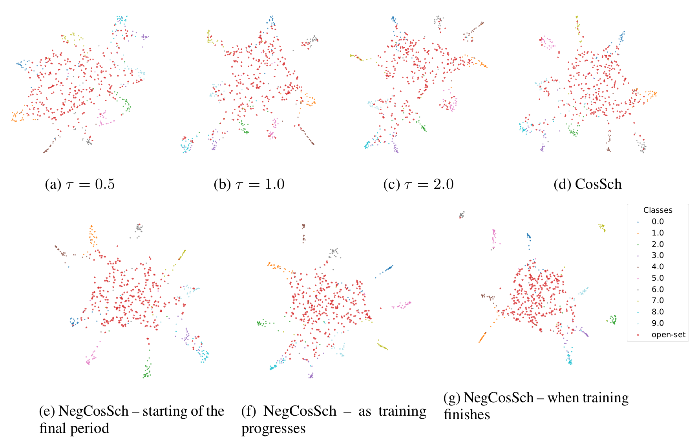

# Boosting Open Set Recognition Performance through Modulated Representation Learning
Implementation of the paper:
### Boosting Open Set Recognition Performance through Modulated Representation Learning
Accepted at ICLR 2026 | OpenReview: (https://openreview.net/pdf?id=vpBKry7kL5)


## Overview


This research explores the impact of temperature modulation on representation learning within open-set scenarios. We introduce a suite of novel temperature scheduling (TS) strategies — most notably our Negative Cosine Schedule (NegCosSch).

Our schedules can boost both open set recognition (OSR) and closed set performance for many existing (OSR) loss functions, such as cross-entropy, contrastive, or ARPL loss, with zero computational overhead, providing enhancements irrespective of the OSR scoring rule, model architecture, data augmentations, even on top of label smoothing, with benefits that are more prominently realized as the number of training classes increases.

This repository contains the official implementation of this project. Our code allows for training, evaluation, and reproduction of the key results presented in the paper.



Fig.: Representation spaces for different temperature schedules on Caltech-UCSD-Birds dataset. (a)- (c) representations for constant temperatures ($\tau$). For lower $\tau$, the representations of unknown samples are distributed and so are the representations of known classes, leading to a sharp decision boundary. For higher $\tau$, the representations of known classes are  more compact, making the decision boundary smoother. However, unknown samples overlap with the clusters of known classes. Mid value of $\tau$ achieves a trade-off but does not gain the benefits of both ends. (e)- (g) show representation spaces for our NegCosSch. A lower $\tau$ at the start leads to a coarse decision and the model gradually makes the classes more compact and the unknown representations are pushed away.

## Basic Usage / Quick Start
Our Negative Cosine Scheduling can be integrated into any method using a few lines of code. For example, for cross-entropy loss:

```python
from temp_schedulers import M_NegCosineTemperatureScheduler

if(args.temperature_scheduling):
    TS=M_NegCosineTemperatureScheduler(tau_plus=2.0,tau_minus=0.5, T=2*args.N_epochs))
for epoch in range(1,args.N_epochs+1):
    if(args.temperature_scheduling):
        criterion.temperature = TS.get_temperature(epoch)
    # rest of the code
    ... ...
```

### Training

Basic commands to start training are available at bash_scripts

### Results 
Table: Performance (%) on CE loss with and without the proposed schedule. Open set results are shown on `Easy / Hard' splits.

| Schedule | | CUB | | | Aircraft | | | Scars | | | TinyImageNet | |
| :--- | :--- | :--- | :--- | :--- | :--- | :--- | :--- | :--- | :--- | :--- | :--- | :--- |
| | Accuracy | AUROC | OSCR | Accuracy | AUROC | OSCR | Accuracy | AUROC | OSCR | Accuracy | AUROC | OSCR |
| Baseline(const.) | 84.43 | 83.55 / 74.98 | 70.49 / 63.34 | 90.88 | 90.35 / 81.48  | 82.05 / 74.25 | 96.76 | 94.03 / 84.82 | 91.04 / 82.19 | 81.95 | 78.6 | 69.22 |
| **NegCosSch(ours)**  | 86.12 | 86.79 / 78.08 | 74.7 / 67.3 | 91.15 | 91.15 / 83.23 | 82.99 / 76 | 97.22 | 95.18 / 86.26 | 92.57 / 83.95 | 81.98 | 79.21 | 69.84 |


### Citation

If you use this code or our paper, please cite:
<pre>
@inproceedings{kundu2026boosting,
    title={Boosting open set recognition performance through modulated representation learning},
    author={Kundu, Amit Kumar and Patil, Vaishnavi and Jaja, Joseph},
    booktitle={International conference on learning representations},
    year={2026}
}
</pre>
    
### Credit
This implementation is built upon from the following repositories:
1. [osr_closed_set_all_you_need](https://github.com/sgvaze/osr_closed_set_all_you_need) by Vaze et al. [2022]: data loading pipeline, base model architecture, evaluation
2. [SupContrast](https://github.com/HobbitLong/SupContrast) by Khosla et al. [2021]: We took the supervised contrastive loss from here.
